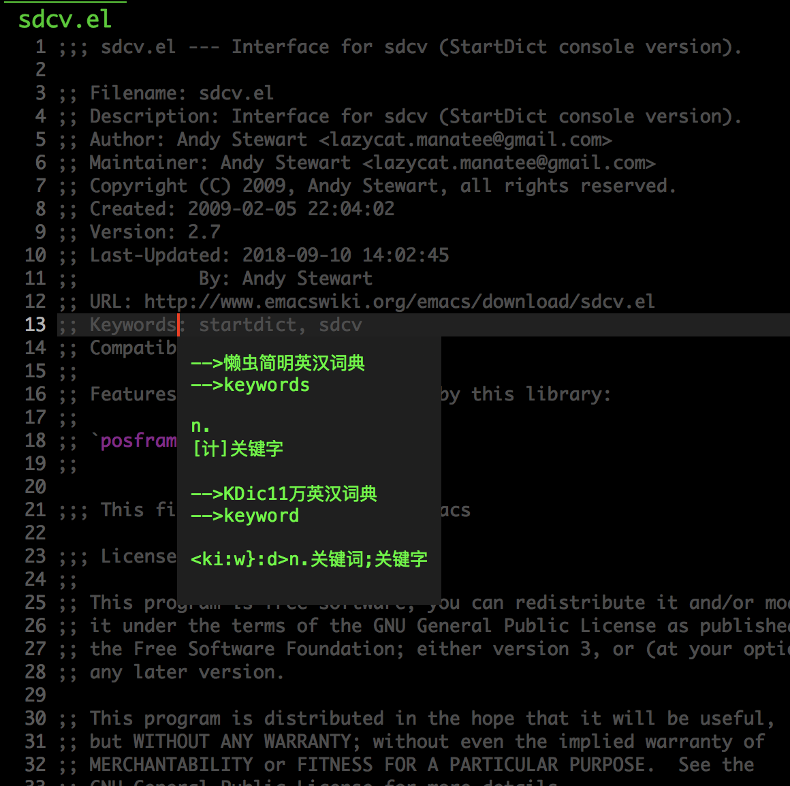

# What is sdcv?

Interface for sdcv (StartDict console version).

Translate word by sdcv (console version of Stardict), and display
translation use posframe or buffer.

## Installation

#### 1. Install Stardict and sdcv

To use this extension, you have to install Stardict and sdcv

##### Linux
```Bash
sudo aptitude install stardict sdcv -y
```

##### MacOS
```Bash
brew install stardict sdcv
```

#### 2. Install posframe extension

You can install get it from:
https://raw.githubusercontent.com/tumashu/posframe/master/posframe.el

#### 3. Require sdcv.el

Put sdcv.el and posframe.el to your load-path.

And add the following to your .emacs startup file.

```Elisp
(require 'sdcv)
```

## Configuration

```Elisp
(setq sdcv-say-word-p t)               ;say word after translation

(setq sdcv-dictionary-data-dir "startdict_dictionary_directory") ;setup directory of stardict dictionary

(setq sdcv-dictionary-simple-list    ;setup dictionary list for simple search
      '("懒虫简明英汉词典"
        "懒虫简明汉英词典"
        "KDic11万英汉词典"))

(setq sdcv-dictionary-complete-list     ;setup dictionary list for complete search
      '(
        "懒虫简明英汉词典"
        "英汉汉英专业词典"
        "XDICT英汉辞典"
        "stardict1.3英汉辞典"
        "WordNet"
        "XDICT汉英辞典"
        "Jargon"
        "懒虫简明汉英词典"
        "FOLDOC"
        "新世纪英汉科技大词典"
        "KDic11万英汉词典"
        "朗道汉英字典5.0"
        "CDICT5英汉辞典"
        "新世纪汉英科技大词典"
        "牛津英汉双解美化版"
        "21世纪双语科技词典"
        "quick_eng-zh_CN"
        ))
```

After completing the above configuration, please execute the command ```sdcv-check```
to confirm that the dictionary settings is correct,
otherwise sdcv will not work because there is no dictionary file in sdcv-dictionary-data-dir.

## Usage

Below are commands you can use:

| Command              | Description                                  |
| :---                 | :---                                         |
| sdcv-search-pointer  | Search around word and display with buffer.  |
| sdcv-search-pointer+ | Search around word and display with tooltip. |
| sdcv-search-input    | Search input word and display with buffer.   |
| sdcv-search-input+   | Search input word and display with tooltip.  |

Tips:

If current mark is active, sdcv commands will translate
region string, otherwise translate word around point.

## Dictionary
You can download sdcv dictionary from http://download.huzheng.org/dict.org/
